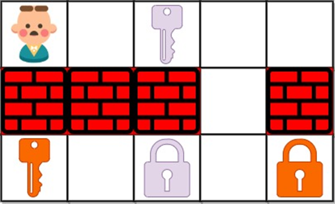

#  The Shortest Path to Get All Keys of a matrix.

### Introduction

In a game to collect all keys (if possible) in the least amount of moves possible
The player must navigate in the matrix and deal with 
Walls, Locks, and collect keys.

### A mathematical model for the solution

We choose Breadth-first search since it has a running time of O(V+E) every vertex and every edge will be checked once.

### The Algorithm Analysis 

We first setup the game by using nested loops to iterate over all items of the game board. To find the starting point and the number of keys in the game.
We then start the queue from the starting point with 0 moves, and the we move in all possible directions while saving the visited nodes in a set (unique) 
We check before moving if we have already found all keys matching the total number of keys, in the setup and then return the total number of moves if yes. Or If we exhausted all moves (the queue is fully popped)  we return “-1” 
We add each possible move to the queue and before that we check if moving to that place makes contact with a wall, key, or empty space (valid move)
Basic Operation: Comparison 

### The time and space complexity

Example
Game board = [  ['D','@','.','C'] , ['c','.','#','d']  ]
Time complexity
1.	In the first loop we iterate over the game board to find all keys and starting point in this case n2
2.	Then for every possible move for the queue element 4 ( directions ) 4 * n2 we check the surroundings
So, we get O( n * m)

Space complexity
O(|V|) at most we have all vertices in the queue. 
